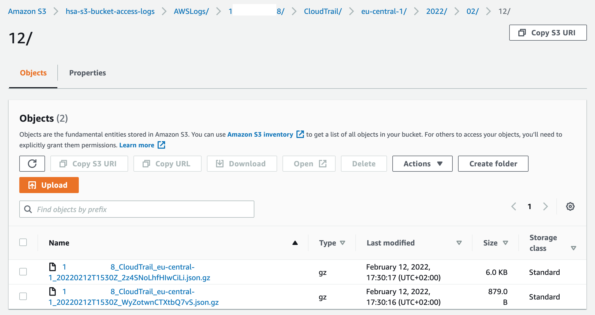

# HSA L24: AWS S3

## Task
* Create AWS S3 bucket where objects can’t be modified and all requests are logged.

## Getting Started

### Create 2 AWS S3 buckets
* hsa-s3-bucket is a bucket for images
* hsa-s3-bucket-access-logs is a bucket for logs


### Configure WORM for 'hsa-s3-bucket' bucket


### Configure Server Access Logging


### Configure Trail Configuration


### Log Files


### Cloudtrail Log Sample
<details>
    <summary>Click to expand</summary>

```json
{
    "Records": [
        {
            "eventVersion": "1.08",
            "userIdentity": {
                "type": "AWSService",
                "invokedBy": "cloudtrail.amazonaws.com"
            },
            "eventTime": "2022-02-12T15:51:01Z",
            "eventSource": "s3.amazonaws.com",
            "eventName": "PutObject",
            "awsRegion": "eu-central-1",
            "sourceIPAddress": "cloudtrail.amazonaws.com",
            "userAgent": "cloudtrail.amazonaws.com",
            "requestParameters": {
                "bucketName": "hsa-s3-bucket-access-logs",
                "Host": "hsa-s3-bucket-access-logs.s3.eu-central-1.amazonaws.com",
                "x-amz-acl": "bucket-owner-full-control",
                "x-amz-server-side-encryption": "AES256",
                "key": "AWSLogs/13xxxxxx68/CloudTrail/eu-central-1/2022/02/12/13xxxxxx68_CloudTrail_eu-central-1_20220212T1550Z_6EdSwJu0Rq7Nd5Zj.json.gz"
            },
            "responseElements": {
                "x-amz-server-side-encryption": "AES256"
            },
            "additionalEventData": {
                "SignatureVersion": "SigV4",
                "SSEApplied": "SSE_S3",
                "AuthenticationMethod": "AuthHeader",
                "bytesTransferredOut": 0
            },
            "requestID": "07D7PA6H1FSKBQ58",
            "eventID": "b777b492-2f84-4cb9-aec6-0e59533cc96b",
            "readOnly": false,
            "resources": [
                {
                    "type": "AWS::S3::Object",
                    "ARN": "arn:aws:s3:::hsa-s3-bucket-access-logs/AWSLogs/13xxxxxx68/CloudTrail/eu-central-1/2022/02/12/13xxxxxx68_CloudTrail_eu-central-1_20220212T1550Z_6EdSwJu0Rq7Nd5Zj.json.gz"
                },
                {
                    "accountId": "13xxxxxx68",
                    "type": "AWS::S3::Bucket",
                    "ARN": "arn:aws:s3:::hsa-s3-bucket-access-logs"
                }
            ],
            "eventType": "AwsApiCall",
            "managementEvent": false,
            "recipientAccountId": "13xxxxxx68",
            "sharedEventID": "e9242922-ee89-4693-ba63-8d6c831606fe",
            "eventCategory": "Data"
        }
    ]
}
```    

</details>

